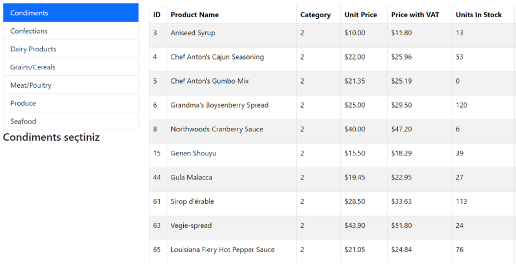
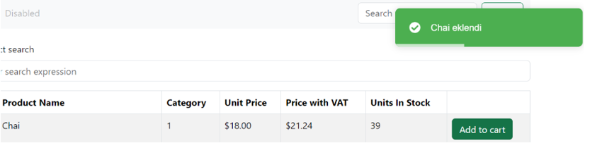
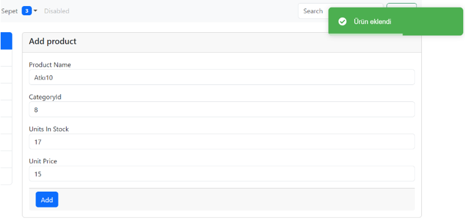
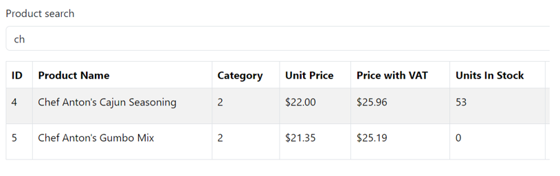
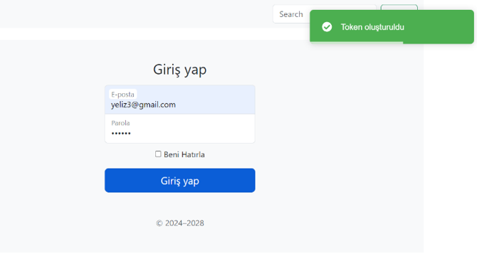

# 🚀 TradeCoreAPI  

TradeCoreAPI, temel e-ticaret işlevlerini sunan bir **RESTful API**'dir.  
C# ve .NET Core kullanılarak geliştirilmiştir ve kullanıcıların ürünleri görüntüleyip sepet yönetimi yapmasına olanak tanır.  

## 📂 Özellikler  

TradeCoreAPI şu temel işlevleri sunar:  
✅ Ürünleri listeleme  
✅ Kategorilere göre ürünleri listeleme  
✅ Ürün arama  
✅ Sepete ürün ekleme ve silme  
✅ Kullanıcı girişi yapma ve üye olma  
✅ Yeni ürünleri sisteme yükleme  

## 📌 Ekran Görüntüleri  

 

 

  
